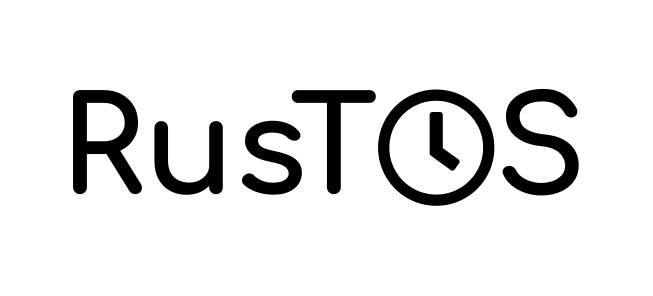

    

Powerful real-time operating system for embedded systems.

[![MIT licensed][mit-badge]][mit-url]

[mit-badge]: https://img.shields.io/badge/license-MIT-blue.svg
[mit-url]: LICENSE

 

Rustos is currently in development, but contributions are welcome. Its goal is to provide a safe and stable environment for running applications on ARM, RISC-V, and x86 based architectures.
